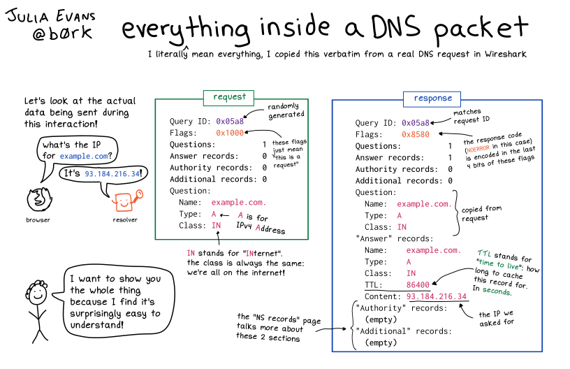

import WarnBox from "../../../src/components/boxes/WarningBox.tsx";
import Blockquote from "../../../src/components/boxes/blockquote/blockquote.tsx";

I like to just randomly spend my time on the internet, and every once in a while
i stumble upon interesting blog posts. I have for a very long time considered
myself really bad at everything related to networking. 

I found this blog post about how you would go about to write a DNS client. I just
glanced through it without looking at any implementations, and then decided to
look up the RFC and suddenly had this feeling that... i could write a client myself.

Julia Evans at [wizard zines](https://wizardzines.com/comics/dns-packet/) makes
these amazing comics and she had this image that showed what a DNS
request/response looked like and it looked so simple.




So in this blog posts and maybe some additional blog posts i will write about
all the things i learnt during the development of my dns client [Who are
you?](https://github.com/Tandolf/who) written in rust. Some thing might be
specification related related, and others might be coding/implementation
related. For instance how i solved certain problems in code.

## What is DNS (Domain Name System)?

Like i usually do, i start out with the wikipedia explanation.

    <Blockquote source="wikipedia">
    The Domain Name System (DNS) is a hierarchical and distributed naming system for
computers, services, and other resources ... it translates readily memorized
domain names to the numerical IP addresses needed for locating and identifying
computer services and devices with the underlying network protocols.
    </Blockquote>

The short explanation is that the internet has no idea what web addresses are,
the internet works with ip addresses. So all over the internet there are DNS
servers that you can query with a domain name and get an ip-address back instead.
So think of DNS-servers as sort of old school phonebooks.

The original DNS specification is defined in the [rfc 1035](https://datatracker.ietf.org/doc/html/rfc1035), and we are going to reference that throughout this post.

There has been significate updates of the DNS protocol throughout the years. Especially with the addition of _DNSSEC_ which currently is defined by [rfc 4033](https://datatracker.ietf.org/doc/html/rfc4033), [rfc4034](https://datatracker.ietf.org/doc/html/rfc4034) and [rfc4035](https://datatracker.ietf.org/doc/html/rfc4035). _DNSSEC_ wont be covered in this post as it is a big topic.

## Lets make a DNS Request

So in order to make a dns request there are several different dns clients out
there. Im going to use the program `dig` but there are others like `nslookup`
etc.

```bash
➜  ~ dig blog.toerktumlare.com

; <> DiG 9.18.18-0ubuntu0.22.04.1-Ubuntu <> blog.toerktumlare.com
;; global options: +cmd
;; Got answer:
;; ->HEADER<- opcode: QUERY, status: NOERROR, id: 40955
;; flags: qr rd ra; QUERY: 1, ANSWER: 5, AUTHORITY: 0, ADDITIONAL: 1

;; OPT PSEUDOSECTION:
; EDNS: version: 0, flags:; udp: 65494
;; QUESTION SECTION:
;blog.toerktumlare.com.		IN	A

;; ANSWER SECTION:
blog.toerktumlare.com.	3600	IN	CNAME	tandolf.github.io.
tandolf.github.io.	3600	IN	A	185.199.108.153
tandolf.github.io.	3600	IN	A	185.199.109.153
tandolf.github.io.	3600	IN	A	185.199.110.153
tandolf.github.io.	3600	IN	A	185.199.111.153

;; Query time: 59 msec
;; SERVER: 127.0.0.53#53(127.0.0.53) (UDP)
;; WHEN: Sat Nov 11 18:38:37 CET 2023
;; MSG SIZE  rcvd: 145
```

So a simple DNS request on this blog returns the above information. There is a
lot of information returned, but what does the _actual_ request and response
look like.
    <br />
    <br />
    <br />
    <br />
If we run `tcpdump` and sniff the traffic we get the following.

```bash
➜  ~ sudo tcpdump --interface any -n port 53 -X
tcpdump: data link type LINUX_SLL2
tcpdump: verbose output suppressed, use -v[v]... for full protocol decode
listening on any, link-type LINUX_SLL2 (Linux cooked v2), snapshot length 262144 bytes
18:49:49.939297 lo    In  IP 127.0.0.1.38500 > 127.0.0.53.53: 39085+ [1au] A? blog.toerktumlare.com. (62)
	0x0000:  4500 005a c2c1 0000 4011 b99b 7f00 0001  E..Z....@.......
	0x0010:  7f00 0035 9664 0035 0046 fe8d 98ad 0120  ...5.d.5.F......
	0x0020:  0001 0000 0000 0000 0462 6c6f 670c 746f  .........blog.to
	0x0030:  6572 6b74 756d 6c61 7265 0363 6f6d 0000  erktumlare.com..
	0x0040:  0100 0100 0029 04d0 0000 0000 000c 000a  .....)..........
	0x0050:  0008 e157 ecab eb0d 51bd                 ...W....Q.
18:49:49.939588 lo    In  IP 127.0.0.53.53 > 127.0.0.1.38500: 39085 5/0/1 CNAME tandolf.github.io., 
  A 185.199.108.153, 
  A 185.199.110.153, 
  A 185.199.109.153, 
  A 185.199.111.153 (145)
	0x0000:  4500 00ad 8a61 4000 0111 f0a8 7f00 0035  E....a@........5
	0x0010:  7f00 0001 0035 9664 0099 fee0 98ad 8180  .....5.d........
	0x0020:  0001 0005 0000 0001 0462 6c6f 670c 746f  .........blog.to
	0x0030:  6572 6b74 756d 6c61 7265 0363 6f6d 0000  erktumlare.com..
	0x0040:  0100 01c0 0c00 0500 0100 000b 6f00 1307  ............o...
	0x0050:  7461 6e64 6f6c 6606 6769 7468 7562 0269  tandolf.github.i
	0x0060:  6f00 c033 0001 0001 0000 0b6f 0004 b9c7  o..3.......o....
	0x0070:  6c99 c033 0001 0001 0000 0b6f 0004 b9c7  l..3.......o....
	0x0080:  6e99 c033 0001 0001 0000 0b6f 0004 b9c7  n..3.......o....
	0x0090:  6d99 c033 0001 0001 0000 0b6f 0004 b9c7  m..3.......o....
	0x00a0:  6f99 0000 29ff d600 0000 0000 00         o...)........
^C
2 packets captured
4 packets received by filter
0 packets dropped by kernel
```

This is once again a lot of information. The first chunk, is the actual query.
While the second part is the response from the dns server.
    <br />
    <br />
    <br />
    <br />
So if we isolate just the query:

```bash
18:49:49.939297 lo    In  IP 127.0.0.1.38500 > 127.0.0.53.53: 39085+ [1au] A? blog.toerktumlare.com. (62)
	0x0000:  4500 005a c2c1 0000 4011 b99b 7f00 0001  E..Z....@.......
	0x0010:  7f00 0035 9664 0035 0046 fe8d 98ad 0120  ...5.d.5.F......
	0x0020:  0001 0000 0000 0000 0462 6c6f 670c 746f  .........blog.to
	0x0030:  6572 6b74 756d 6c61 7265 0363 6f6d 0000  erktumlare.com..
	0x0040:  0100 0100 0029 04d0 0000 0000 000c 000a  .....)..........
	0x0050:  0008 e157 ecab eb0d 51bd                 ...W....Q.
```

We see that there is some text and just a bunch of different hex numbers. Out of
all these hex numbers we need first start to discard all the things we don't
need. The first `20 bytes` is the ipv4 header so we can discard that.

The ipv4 header:
```
  4500 005a c2c1 0000 4011 b99b 7f00 0001 7f00 0035
```

The next `8 bytes` after that is the _UDP Header_. And already we learnt
something, and that is that __DNS is sent over UDP__. You have to remember that the
original DNS specification is from November 1987, it was in the early days of
the internet.

The UDP header:
```
  9664 0035 0046 fe8d 
```

Its worth noting that the specification has been updated several times, and that
you can in fact send DNS over TCP (most DNS resolvers will accept it) and that DNSSec
has also been introduced which adds a lot of security features to the protocol.
    <br />
    <br />
    <br />
    <br />
So what we are left with is:
```
  98ad 0120 0001 0000 0000 0001 0462 6c6f 670c 746f 
  6572 6b74 756d 6c61 7265 0363 6f6d 0000 0100 0100 
  0029 04d0 0000 0000 000c 000a 0008 e157 ecab eb0d 
  51bd
```

And this ladies and gentlemen is our raw dns request!

## Anatomy of a DNS message
So i think it is about time that we pull up the official dns specification and
if we look in the _message_ section of the rfc, they have a very nice image
representation of what a single dns message looks like. So all in all a DNS
messages, both requests and responses, has the following general structure.

```
    +---------------------+
    |        Header       |
    +---------------------+
    |       Question      | the question for the name server
    +---------------------+
    |        Answer       | RRs answering the question
    +---------------------+
    |      Authority      | RRs pointing toward an authority
    +---------------------+
    |      Additional     | RRs holding additional information
    +---------------------+
```

One of the things we are going to see later is that the Header and the Question
is always going to be in the message and the responses, but depending on what
response we get back the last three sections of the message will differ.

## The DNS Header

So we are going to start out with the header, and an image usually says more
than a 1000 words so we are going to extract an image (once again) [rfc
1035](https://datatracker.ietf.org/doc/html/rfc1035#section-4.1.1) that shows
the overall structure of the header section.

```bash
                                    1  1  1  1  1  1
      0  1  2  3  4  5  6  7  8  9  0  1  2  3  4  5
    +--+--+--+--+--+--+--+--+--+--+--+--+--+--+--+--+
    |                      ID                       |
    +--+--+--+--+--+--+--+--+--+--+--+--+--+--+--+--+
    |QR|   Opcode  |AA|TC|RD|RA|   Z    |   RCODE   |
    +--+--+--+--+--+--+--+--+--+--+--+--+--+--+--+--+
    |                    QDCOUNT                    |
    +--+--+--+--+--+--+--+--+--+--+--+--+--+--+--+--+
    |                    ANCOUNT                    |
    +--+--+--+--+--+--+--+--+--+--+--+--+--+--+--+--+
    |                    NSCOUNT                    |
    +--+--+--+--+--+--+--+--+--+--+--+--+--+--+--+--+
    |                    ARCOUNT                    |
    +--+--+--+--+--+--+--+--+--+--+--+--+--+--+--+--+
```

A DNS header is always __12 bytes long__ and contains all the metadata for the
message. This includes both information that has to do with the request, but
also information about the response, since a DNS message is actually both.

## Id
```bash
      0  1  2  3  4  5  6  7  8  9  0  1  2  3  4  5
    +--+--+--+--+--+--+--+--+--+--+--+--+--+--+--+--+
    |                      ID                       |
    +--+--+--+--+--+--+--+--+--+--+--+--+--+--+--+--+
```
A 16 bit identifier assigned by the program that generates the query.  This
identifier is copied over to the corresponding reply and can be used by the
requester to match up replies to outstanding queries. So if you make a lot of
requests, this id ccan help you match up what request to its corresponding
response. For instance in a async environment.

Our first 2 bytes have the hex number `98ad`, which converted to decimal is
`39085` so that is our id for this request.

## Flags
```bash
      0  1  2  3  4  5  6  7  8  9  0  1  2  3  4  5
    +--+--+--+--+--+--+--+--+--+--+--+--+--+--+--+--+
    |QR|   Opcode  |AA|TC|RD|RA|   Z    |   RCODE   |
    +--+--+--+--+--+--+--+--+--+--+--+--+--+--+--+--+
```
Several different flags that will for instance define what type of DNS message
this is or provide instructions to the server of how you want it to process your
request. This header will also contain a response code that will tell us of the
outcome of the request (if there was an error or not etc.). 

    <br />
    <br />
    <br />
    <br />
Lets go through all the flags one by one.

### - QR (Query/Response)
A one bit field that specifies whether this message is a query (0), or a
response (1).

### - OPCODE (Operation Code)
A four bit field that specifies what kind of query this message is. This value
is set by the originator of a query and copied into the response. The values
are:

        0               a standard query (QUERY)

        1               an inverse query (IQUERY)

        2               a server status request (STATUS)

        3-15            reserved for future use

### - AA (Authoritative Answer)
this bit is valid in responses, and specifies if the responding name server is
an authority for the domain name we are asking about. Basically it denotes
if the name server we asked has _responsibility_ over the domain.

Note that the contents of the answer section may have multiple owners because of
aliases. This AA bit corresponds to the name which matches the query name.

### - TC (TrunCation) 
Specifies that this message was truncated due to length greater than that
permitted on the transmission channel (so basically if this message was too long).

### - RD (Recursion Desired)
This bit can be set in a query and is copied into the response. If RD is set, it
directs the name server to pursue the query recursively. So if the name server
im asking doesn't know what the IP-address is for the domain i'm querying about,
im telling the name server to start asking around to other name servers until it
fins one that does know. This bit is usually always set, but there are some
user cases when you don't want to do recursive lookups. 

### - RA (Recursion Available) 
This be is set or cleared in a response, and denotes whether recursive query
support is available in the name server.

### - Z               
Reserved for future use.  Must be zero in all queries and responses.

### - RCODE (Response Code)  
Response code - this 4 bit field is set as part of responses.  The values have
the following interpretation:

0\. __No error condition__

1\. __Format error__ - The name server was unable to interpret the query.

2\. __Server failure__ - The name server was unable to process this query due to
a problem with the name server.

3\. __Name Error__ - Meaningful only for responses from an authoritative name server, this code
signifies that the domain name referenced in the query does not exist.

4\. __Not Implemented__ - The name server does not support the requested kind of query.

5\. __Refused__ - The name server refuses to perform the specified operation for policy
reasons. For example, a name server may not wish to provide the information to the
particular requester, or a name server may not wish to perform a particular
operation (e.g., zone transfer) for particular data.

6-15\. __Reserved for future use__

## Count Section

```bash
      0  1  2  3  4  5  6  7  8  9  0  1  2  3  4  5
    +--+--+--+--+--+--+--+--+--+--+--+--+--+--+--+--+
    |                    QDCOUNT                    |
    +--+--+--+--+--+--+--+--+--+--+--+--+--+--+--+--+
    |                    ANCOUNT                    |
    +--+--+--+--+--+--+--+--+--+--+--+--+--+--+--+--+
    |                    NSCOUNT                    |
    +--+--+--+--+--+--+--+--+--+--+--+--+--+--+--+--+
    |                    ARCOUNT                    |
    +--+--+--+--+--+--+--+--+--+--+--+--+--+--+--+--+
```
### QDCOUNT (Questions Defined)
an unsigned 16 bit integer specifying the number of entries in the question
section.

### ANCOUNT (Answers)
an unsigned 16 bit integer specifying the number of resource records in the
answer section.

### NSCOUNT (Name Servers)
an unsigned 16 bit integer specifying the number of name server resource records
in the authority records section.

### ARCOUNT (Additional Record)
an unsigned 16 bit integer specifying the number of resource records in the
additional records section.
    <br />
    <br />
    <br />
The 8 bytes after the id and flags are the 4 counters represented as u16s.

```
0001 0000 0000 0001

QDCOUNT = 1
ANCOUNT = 0
NSCOUNT = 0
ARCOUNT = 1
```

So our counters show us that there is one _question_ and one _additional record_ in our message.

<WarnBox>
ARCount is commonly set to 1 indicating that there is an _additional record_ included. DNS has pretty much _outgrown_ its header size and there was a need to be able to include more meta information in messages so DNS was extended in [rfc 6891](https://datatracker.ietf.org/doc/html/rfc6891) to include _pseudo records_ that is used to include additional meta information in both requests and responses.
</WarnBox>


## DNS Question section

Lastly in a standard DNS message is the actual query. THis section contains the domain name we are asking for and and the definition of what type of _resource records_ we want.

```bash
                                    1  1  1  1  1  1
      0  1  2  3  4  5  6  7  8  9  0  1  2  3  4  5
    +--+--+--+--+--+--+--+--+--+--+--+--+--+--+--+--+
    |                                               |
    /                     QNAME                     /
    /                                               /
    +--+--+--+--+--+--+--+--+--+--+--+--+--+--+--+--+
    |                     QTYPE                     |
    +--+--+--+--+--+--+--+--+--+--+--+--+--+--+--+--+
    |                     QCLASS                    |
    +--+--+--+--+--+--+--+--+--+--+--+--+--+--+--+--+
```
<br />
<br/>
### QNAME (Question Name)

The first part consists of a domain name which in the specification is called a _QNAME_ (question name). This is a dynamically sized field with a max value of 255 bytes. The format of the data is a mixture of numbers and _labels_ in the ASCII format, with each _label_ of a domain name prefixed by its length.

```bash
# format:
<length><label><length><label><Null>

# example:
3www6google3com
```

<br/>
<br/>
So if we convert the data in our message from previous we see the following:
```bash
# hex values
04 62 6c 6f 67 0c 74 6f 65 72 6b 74 75 6d 6c 61 72 65 03 63 6f 6d 00

# numeric and ascii values
 4  b  l  o  g 12  t  o  e  r  k  t  u  m  l  a  r  e  3  c  o  m NULL

# result formatted
4 blog 12 toerktumlare 3 com NULL
```

As you can see no dots are included, they are substituted by the length value.

<br/>
<br/>
<WarnBox>
There are some size limits defined in the RFC. We are only allowed to have ASCII characters in names. Additional restriction include a length limit of 63 octets or less. This limit is actually defined because of how compression in DNS messages is implemented. Additional limits that need to be considered is 255 bytes for a single domain name and 512 bytes which is the maximum size of UDP messages.
</WarnBox>
<br/>
<br/>
<br/>
<br/>
### QTYPE and QCLASS

The last parts of the body section of dns message is the _QType_ and _QClass_.

```bash
      0  1  2  3  4  5  6  7  8  9  0  1  2  3  4  5
    +--+--+--+--+--+--+--+--+--+--+--+--+--+--+--+--+
    |                     QTYPE                     |
    +--+--+--+--+--+--+--+--+--+--+--+--+--+--+--+--+
    |                     QCLASS                    |
    +--+--+--+--+--+--+--+--+--+--+--+--+--+--+--+--+
```

The _QType_ value is the more important value of the two. This value defines what kind of record we would like to have returned. Common questions would for instance to ask for an _A_ record, or maybe a _CNAME_ record. Each record has a defined number, and the [dns rfc specifies a list](https://datatracker.ietf.org/doc/html/rfc1035#section-3.2.2) of type values. Throughout the years, more types have been added for instance the _AAAA_ record was added to support ipv6 was [first added in December 1995](https://datatracker.ietf.org/doc/html/rfc1886) and later [updated in October 2003](https://datatracker.ietf.org/doc/html/rfc3596).

Lastly _QClass_ was previously used to define in what type of network the query was made. It only has 4 definitions:

        IN                1 the Internet

        CS                2 the CSNET class (Obsolete - used only for examples in some obsolete RFCs)

        CH                3 the CHAOS class

        HS                4 Hesiod [Dyer 87]

Nowadays most of these definitions are deprecated so in a standard DNS query this value is always set to 1 to represent _the internet_.

## Analysing our full question

So if we do a full breakdown of our request we get the following:

```bash
# id
98ad                                                   # => 39085

# header
0100                                                   # => b0000_0001 b0000_0000
                                                       # query    = 0
                                                       # opcode   = 0
                                                       # Authoritative Answer = 0
                                                       # TrunCation = 0
                                                       # Recursion Desired = 1
                                                       # Recursion Available = 0
                                                       # Z = 0
                                                       # Response Code = 0
 

# qdcount
0001                                                   # => One question

# ancount
0000                                                   # => No answer 

# nscount
0000                                                   # => No name server record

# arcount
0001                                                   # => one additional record 

# length
04                                                     # => 4

# label
626c 6f67                                              #  => "blog"

#length
0c                                                     # => 12

# label
746f 6572 6b74 756d 6c61 7265                          # => "toerktumlare"

# length
03                                                     # => 3

# label
636f 6d                                                # => com

# null byte
00 

# QType
0001                                                   # => A-record 

#QClass
0001                                                   # => IN (internet)

# OPT resource record (rfc6891)
0000 2904 d000 0000 0000 0c00 0a00 08e1 57ec abeb 0d51 bd
```

## OPT RR-Record
The last bytes in our DNS message is what is called an _optional resource record_ and is an extension that was added to expand on the capabilities of DNS. This feature is OPTIONAL and `dig` uses this feature when doing requests. As it is optional, means that most DNS servers will accept queries without this additional resource record.

## Message compression

There is some compression actually built into the DNS format to send smaller
messages. And im not going to explain how it works in this blog post but there
might be a separate post about it with a code example of how to solve the
compression in DNS messages.

# Final Thoughts
DNS is a fascinating protocol that is used all over the internet. It has been expanded many times, and you can sense a lot of the _old internet_ within the protocol. By breaking down these messages, i managed to learn a lot more about DNS and networking in general.

You are welcome to check out my simple implementation of my basic dns client [Who are you?](https://www.github.com/tandolf/who) written in rust.