Monday the 13th of January Brian Krebs published on his blog that he had sources telling him that the day after, Microsoft would release software updates that would fix a vulnerability in the Windows Crypto API.

And indeed, the day after on the 14th of January, NSA released a cybersecurity advisory that disclosed a vulnerability in the crypto API. This vulnerability allowed an attacker to defeat the certificate validation in Windows 10 and it would affect TLS, code signing etc.

Less than 24 hours later, security researcher Salim Rashid published a proof of concept on his twitter account showing that he successfully “rick rolled” github.com and nsa.gov using a custom-made CA certificate.

<blockquote className="twitter-tweet" data-theme="dark"><p lang="und" dir="ltr">CVE-2020-0601 <a href="https://t.co/8tJsJqvnHj">pic.twitter.com/8tJsJqvnHj</a></p>&mdash; ✨saleem✨ ⍼ (@saleemrash1d) <a href="https://twitter.com/saleemrash1d/status/1217495681230954506?ref_src=twsrc%5Etfw">January 15, 2020</a></blockquote> <Script src="https://platform.twitter.com/widgets.js" charset="utf-8" />

Shortly after this, Ollypwn aka. Oliver Lyak, a security researcher from Denmark, published a proof of concept exploit on GitHub for anyone to use. And what struck the world was that the exploit consisted of less than 10 rows of code and anyone could do it.

For the rest of this blog post I’m going to try to explain how this vulnerability works on a very high level, and point out why this exploit is extremely powerful.

## CA Certificates

Let’s start by looking at what a basic CA Certificate consists of. These types of certificates are used to sign other certificates, as a form of trust. You have a certificate and you let a well-known certificate authority (CA) sign your certificate. By signing, they sort of “vouch” that you are who you claim to be.

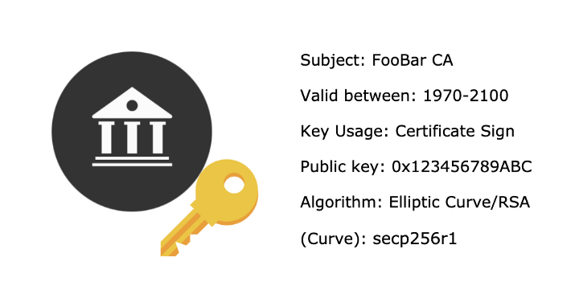

A typical CA certificate contains information such as the subject (who issued it), for how long it is valid, a key usage (what the key is used for), a public key and a declaration of what type of algorithm that is used in the CA certificate.

Two of the most common types of algorithms used are Elliptic Curve and RSA. **It’s important to know that CVE 2020–0601 aka. Curveball only affects Elliptic Curve certificates. RSA type CA certificates are unaffected.**

Elliptic curve is a mathematical concept used in cryptology. [There are many different types of mathematical curves](https://www.secg.org/SEC2-Ver-1.0.pdf) that can be used when using Elliptic curve cryptography so each elliptic curve certificate must include what type of curve that was used in the specified certificate.

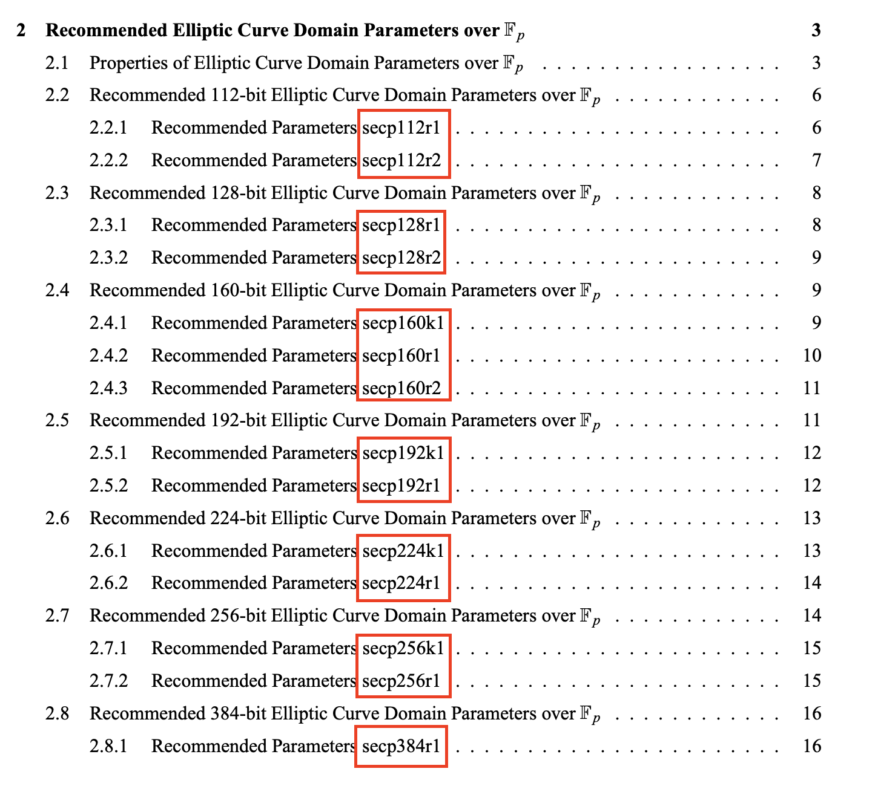

Each curve is made up a series of parameters called p, a, b, G etc. and by declaring that we want a predefined curve like secp256r1, these values (p, a, b, G) will be set for us automatically, and our certificate will use that specified curve.

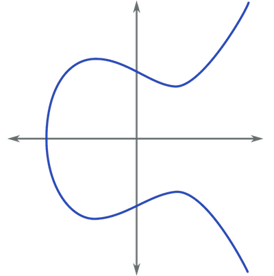

Sometimes you want to use a custom curve or a “not yet implemented” curve and to do so you can include all the needed parameters in the CA Certificate directly instead of defining a predefined curve.

```shell
Curve: parameters p/a/b/G
```

When Microsoft implemented the functionality, that you can supply your own parameters to represent an elliptic curve, that’s when the vulnerability CVE 2020–0601 got introduced into Windows 10.

## Certificate Usages

Before we can investigate how to exploit CVE 2020–0601, we need to first talk a little about how certificates are used in the real world. We are going to look at one way of using certificates to enforce trust, and that is when requesting websites.

Windows 10 provides a library applications can use to verify certificates. This library is called crypt32.dll and it is here the vulnerability was discovered. Any windows application — such as web browsers, file transfer tools or email clients — that rely on this library, to verify cryptographic signatures, may be affected by CVE 2020–0601.

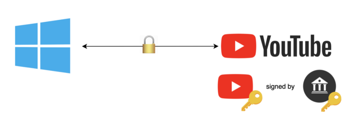

A majority of trusted sites on the internet have their own signed certificate. This is used to verify that, when we request something on the internet, we get it from the actual place we requested it from. It’s to prevent things like man-in-the-middle attacks, fake websites etc.

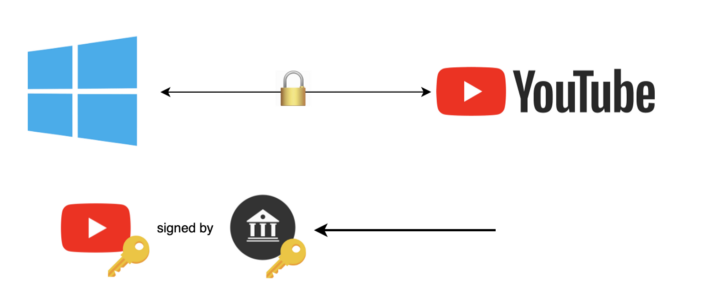

Let’s say we would like to make a connection to youtube.com. As we request to connect to their website, they will first send over their own certificate (that is signed by some CA). Then they will also send over the root CA that signed their certificate (the certificate that vouches that they are who they claim to be).

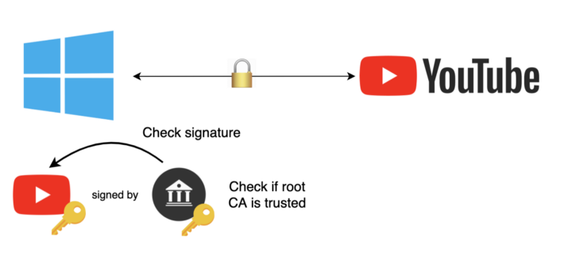

The browser will first verify the signature using the crypt32 library provided by Windows. Then the same library will check against an internal registry that contains many predefined trusted root CA’s, that the CA certificate youtube.com sent us is from someone whom Windows trusts.

If all verifications go well, a secure connection is established and for future requests, crypt32 in Windows will cache the sent root CA so that it can speed up subsequent requests.

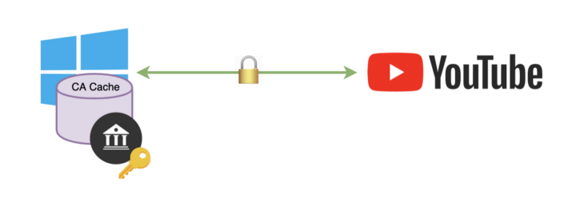

It is here, after caching, that a vulnerability exists that lets an attacker produce a malicious CA certificate that in turn will be trusted by Windows.

## The Vulnerability

If we investigate how crypt32 in Windows verifies CA certificates in its cache, it goes through all cached certificates and checks if the public key in the provided CA certificate matches any of the cached CA certificates public key.

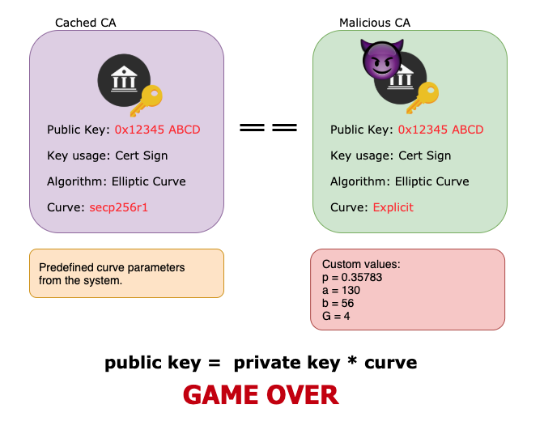

What it on the other hand doesn’t do is verifying that both certificates are using the same type of curve. If we manage to guess the curve and the private key, we can successfully produce a fake CA certificate that we can use to sign other certificates and it is game over.

But before we can produce a fake CA certificate we need to know a bit more about Elliptic Curve cryptology.

## Elliptic Curve Basics

So, what is Elliptic curve cryptography, or ECC for short? It a type of cryptology in a category called asymmetric cryptology. In asymmetric cryptology you have a Public Key and Private Key. The public key can be exposed publicly, and anyone can use it to encrypt things. But the private key is the only thing that can decrypt whatever was encrypted with that particular public key.

It’s very common that you share and store the public key widely across the Internet so that if someone needs to communicate encrypted with you, they can use your public key and then only you with the matching private key will be able to decrypt the message (Quite good right?).

Well we talked a bit before about a set of predefined elliptic curves that you can choose from when generating a CA certificate. These curves are built up by a set of predefined values called P, a, b etc. If we define these values in a specific formula, we get an elliptic curve.


To start generating a public and private key from this curve we first need to define a starting point on the curve, we can call this starting point G (the generator). From this starting point we then start jumping around on the graph “n” number of times.

I’m not going to explain how we jump around on the curve because it’s quite complicated and there is an entire wiki page describing just this so we will leave that out for now. But what you should know is that by jumping around millions, or even billions of times on the curve will result in a series of dots (when you remove the curve) and this will end up as a very large factor. Let’s call this factor “x”. In the end we end up with a simple formula x * G (starting point multiplied by our factor).

This formula will be equal something so let’s add that to, so we end up with something like:

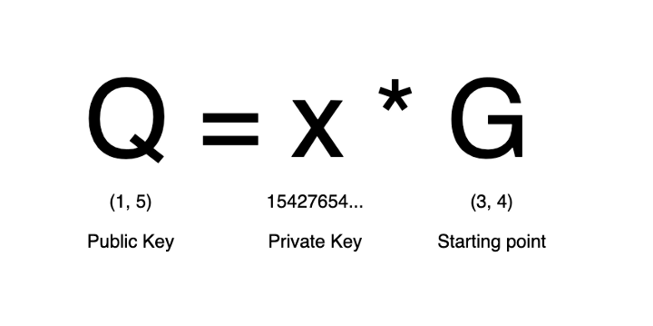

Where G is our starting point on the graph, x is the result of us jumping around, and the product is Q.

When defined, x in this formula is our private key and Q our public key. And as mentioned before our public key we can send to anyone, but how we got the result (x and G) is our “secret sauce” that no one can know anything about.

Trying to derive the key by flipping the formula is what is known as the Discrete Logarithm Problem and is known to be a very difficult problem so that is not a possibility when trying to reverse engineer the private key.

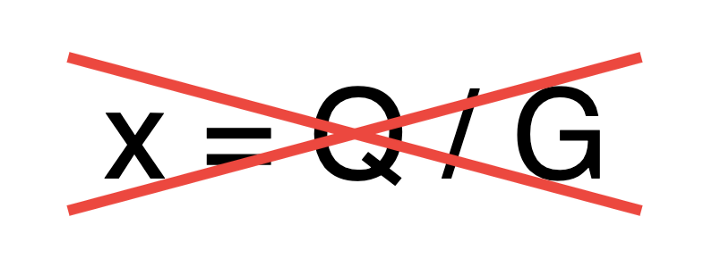

So, for the time being this feels pretty secure, right?

## CVE 2020–0601

With this knowledge as a prerequisite this is where CVE 2020–0601 comes into play. Since Windows does not verify the curve provided in the certificates, we can provide these parameters and create a malicious certificate based on this simple math.

Since we can control the parameters, how about we set the private key to something like 20, or 100 or just something simple…. like the number 1?

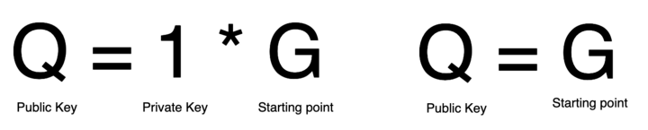

This will result in our public key being equal to our starting point on the graph, and just like that we have the two secrets parameters, just from knowing the public key!

With all this information we can now forge any Elliptic Curve certificate just by acquiring the public key. Here’s an example. We acquire a public key say 1234 and we put this into our formula:

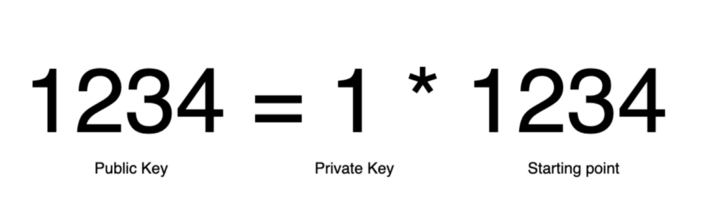

And by using this information, we can then generate a valid CA certificate that we control!

So to recap:

Just by acquiring the public key from any source we can then generate a fully valid malicious CA certificate that we can use to sign any other certificate. This certificate will then be trusted by Windows 10 because it will pass the check against it’s certificate cache.

## Ollypwn’s Proof Of Concept

Oliver Lyak demonstrates this in a Github repository how to exploit the vulnerability by generating a false CA certificate and then proceeds to demonstrate how it can be used to sign other certificates, or sign code as “trusted”.

The code below is taken from his example.

```ruby
require ‘openssl’

# Read file provided in the first argument
raw = File.read ARGV[0]

# Parse the file as a certificate
ca = OpenSSL::X509::Certificate.new(raw)

# Extract the public keyca_key = ca.public_key# Set a private key to 1
ca_key.private_key = 1

# Get the group parameters that contains the curve
group = ca_key.group

# Set the generator parameters (G in our formula) to the public key
group.set_generator(ca_key.public_key, group.order, group.cofactor)

# Ensure we are sending explicit parameters and not a predefined curve
group.asn1_flag = OpenSSL::PKey::EC::EXPLICIT_CURVE

# Set our new group with our fake generator G’ = Q
ca_key.group = group

# Save this to a file as our new CA
File.open(“spoofed_ca.key”, ‘w’) { |f| f.write ca_key.to_pem }
```

It first reads in a predefined CA certificate, for example the MicrosoftECCProductRootCertificateAuthority.cer which is the official certificate Microsoft uses to sign many things with.

Then it reads out the public key from it and then defines at sets some new custom parameters, generator etc. We can see that the code explicitly sets the private key to 1 and then save it to a new spoofed CA certificate that can be used to sign code or other certificates.

This newly generated certificate can be used to act like microsoft and sign other certificates. We essentially can claim that we are Microsoft and vouch for anyone. Extremely powerful.

Ollypwn then continues to demonstrate how to sign some code as “trusted by Microsoft” and also how to generate a website certificate claiming to be issued by www.google.com and then sign this certificate with the crafted “Microsoft” certificate.

What this all boils down to is that by exploiting CVE 2020–0601 we can claim that we are anyone, and we can vouch for anyone on the internet.

This in turn can be used to pass firewalls, push fake updates containing malware to any Windows 10 machine claiming we are “Microsoft”. We can for example set up fake websites claiming that we are any of the big companies and we can also develop malicious programs that windows 10 just blindly will trust as “safe software”.

The possibilities are endless, only creativity will stop you and the hackers out there.

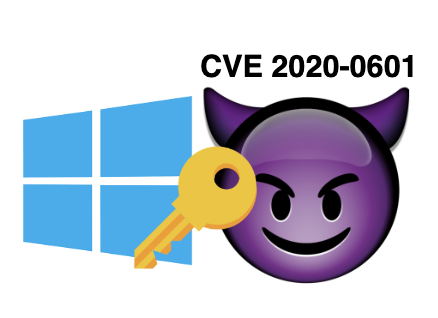

## Summary

This has been a high-level breakdown of CVE 2020–0601 in the Microsoft crypto API that got disclosed to the world on the 14th of January 2020. This text has tried to demonstrate how a simple miss in validation can have a huge impact on the security of the Internet.

This post has also tried to show how this vulnerability can be exploited to generate malicious CA certificates, that in turn can be used to circumvent a lot of security features, like firewalls, website traffic etc.

Final last words are, always patch your systems… Always

## Appendix

https://cve.mitre.org/cgi-bin/cvename.cgi?name=CVE-2020-0601

https://portal.msrc.microsoft.com/en-US/security-guidance/advisory/CVE-2020-0601

https://krebsonsecurity.com/2020/01/cryptic-rumblings-ahead-of-first-2020-patch-tuesday/

https://twitter.com/saleemrash1d/status/1217495681230954506

https://github.com/ollypwn/CurveBall

https://www.secg.org/SEC2-Ver-1.0.pdf
