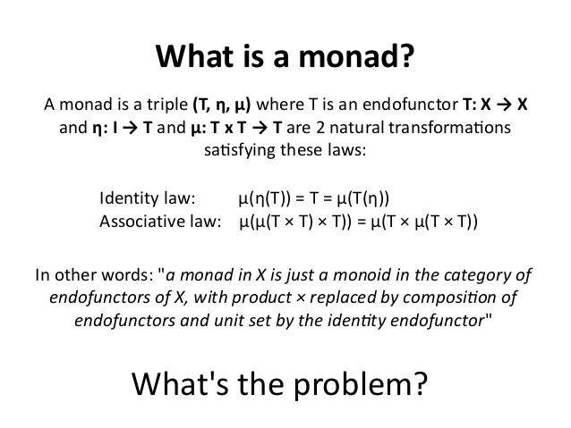
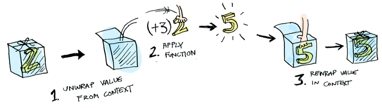

import Blockquote from "../../../src/components/boxes/blockquote/blockquote.tsx";
import SyntaxHighlighter from 'react-syntax-highlighter';
import { dracula } from 'react-syntax-highlighter/dist/esm/styles/hljs';
import WarningBox from "../../../src/components/boxes/WarningBox.tsx";

Monad? What the h…ll is he talking about?
<br />
In this post i’m going to try to explain what a monad is, and then we are going to implement a simple Try/Catch Monad in Java.
<br />
<WarningBox>
Disclaimer, this is written for beginners that have a hard time understanding what a Monad is. It is not written for experienced functional programmers, and I will avoid any of the philosophical arguments that “real” Monads don’t exist in Java because of how Java handles “null” wrongly.
</WarningBox>
<br />
This is written for beginners, and intermediate java developers.
<br />

<br />
If you google Monads you will see that there are about a million ways of explaining what a Monad is. The explanations range from simple ones to mathematical complex ones, and its kind of hard to grasp what a monad actually is.
<br />
In the development world Monads have sometimes been mysterious, complex or just plain dark magic. Im not gonna say that Monads are simple, they can be pretty complex. But they are not as hard as you think! 
<br />
At least not the basics!
<br />

<br />
The simplest way of explaining a Monad is to tell you that it is sort of a programming pattern like MVC, Observable or Singeltons.
<br />
Monads come from the functional programming world and is used in many places in many different ways. But the most concrete explanation id say is that a Monad accepts a type of “something” (this could be an int, string or any other type) and returns a new type containing your “something” type.
<br />
We can then do computation on the internal value of our Monad and return a new Monad containing our newly calculated value.
<br />
The picture here describes it, We give the monad a value, and then we can apply a function on the internal value and we return a new or the same type containing our new value. It’s actually not more complicated than that!
<br />

<br />
And if you look at the picture and think a little you will notice that we have monads in Java already Im going to explain some of them and then we are going to implement our own.
<br />
With this information can you think of a Monad in Java?
<br />
## Optional{'<T>'}.java
<br />
_Optional{'<T>'}_ in java is indeed a Monad!
<br />
It takes a value and returns a new object of the Optional type. Then we can perform computations on the internal value and it returns an Optional containing our new value!
<br />
```java
Optional<String> value = Optional.of("Hello world")
    .map(s -> s.toUpperCase());
```
<br />
<br />
Here we give it a string, we perform a computation using a lambda expression and we return a new object (of type Optional) containing our new value.
<br />
## Streams{'<T>'}
<br />
Is another example of a Monad. But this time we can give it multiple values. We then perform some sort of computation on the multiple values and are given a new object of type Stream, containing our computed values.
<br />
```java
Stream<String> values = Stream.of("Hello", "World")
    .map(s -> s.toUpperCase());
```
<br />
## CompletableFuture{'<T>'}
<br />
Is the newest addition to Monads in java. Unlike Optional and Streams that take values, CompletableFuture takes an async operation and returns a new object of the type CompletableFuture.
<br />
```java
CompletableFuture<String> value = CompletableFuture.supplyAsync(() -> "Hello" + " World")
    .thenApply(s -> s.toUpperCase());
```
<br />
Now that we have seen how monads in Java work on a high level, we can start implementing our own.
<br />
# The Try/Catch Monad
<br />
Often in code you will see the use of try/catch blocks to handle errors.
<br />
Sometimes we even nest try/catch blocks in other try/catch blocks. This is usually pretty ugly and sometimes we end up catching everything in a big giant try catch/block.
<br />
The Optional{'<T>'} type can help us figure out if there is concrete value in a variable. Maybe we can leverage a Monad to tell us if there has been an exception thrown or not, just like a try/catch block?
<br />
```java
//Our old way..
int value = null;
try {
    value = Integer.valueOf("10");
} catch(NumberFormatException e){
    value = 10;
}

//Maybe our new way?
int value = Try.ofThrowable(() -> Integer.valueOf("10"))
                .orElse(10)
                .get();
```
<br />
## Let’s write a Monad! first up Try.class
<br />
So let’s start out with our base class. This is the class that will take in whatever operation that might throw an exception. This will be written using a lot of java generics so you might need to read up a bit on it before starting.
<br />
https://www.baeldung.com/java-generics
(if you need to read up on generics)
<br />
```java
public abstract class Try<T> {

    public static <U> Try<U> ofThrowable(Supplier<U> f) {
        Objects.requireNonNull(f);
        try {
            return Try.successful(f.get());
        } catch (Throwable e) {
            return Try.failure(e);
        }
    }
}
```
  
Our `ofThrowable` method takes in a computation that might throw an exception. This is done using the functional interface `Supplier.class`.
  
`Supplier.class` is a `@FunctionalInterface` which is just a fancy name for an anonymous class that contains a single method.
  
```java
//Using the interface as an anonymous class
Try<Integer> value = Try.ofThrowable(new Supplier<Integer>() {

    @Override
    public Integer get() {
        return Integer.valueOf("1");
    }
});

//Exact same as above but written using a lambda expression
Try<Integer> value = Try.ofThrowable(() -> Integer.valueOf("1"));
```
  
In the try/catch block we call the method `get()` on the passed in `Supplier`.
  
If `get()` throws an exception we catch it and pass it to the failure method, if successful we pass our result value to the success method.
  
```java
try {
    return Try.successful(f.get());
} catch (Throwable e) {
    return Try.failure(e);
}
```
  
## Success/Failure methods
  
Next step is to implement the success and failure methods.
  
They are pretty straight forward.
  
```java
public static <U> Success<U> successful(U u) {
    return new Success<>(u);
}public static <U> Failure<U> failure(Throwable e) {
    return new Failure<>(e);
}
```
  
In the Success method we take some type, and create a new success class containing our computed value.
  
In the Failure method, we take our caught exception and create a new failure class containing the thrown exception.
  
### Success/Failure classes
  
These are just two simple classes extending the `Try.class`, containing either a value of something `T` or a `Throwable`.
  
```java
class Success<T> extends Try<T> {

    private final T value;

    Success(T value) {
        this.value = value;
    }
}

class Failure<T> extends Try<T> {
    private final Throwable e;

    Failure(Throwable e) {
        this.e = e;
    }
}
```

## get()

This function is also pretty simple. We use this method if we want to extract the current value from our two boxes (`Success.class` or `Failure.class`).

```java
//Try.class
public abstract T get() throws Throwable;//Success.class

@Override
public T get() {
    return value;
}

//Failure.class
@Override
public T get() throws Throwable {
    throw e;
}
```

If there is a value, it will return it, if there isn’t it will throw the exception.

## orElse()

So what if our initial computation fails and we want to do something, handle the error so to speak? the `orElse` block is one solution. Here we can return a default value if the original throwable computation fails.

```java
//Try.class 
public abstract T orElse(T value);

//Success.class
@Override
public T orElse(T value) {
    return this.value;
}

//Failure.class
@Override
public T orElse(T value) {
    return value;
}
```

The abstract function description is quite straight forward. We get some type and we return the same type.

In the `Success.class` we return the current value we have stored in the class, while in the `Failure.class` we return the value one would pass in as a returning default value.

## flatMap() declaration

This part is a bit more complicated but what makes monads so good, the ability to transform the value inside the Monad.

What we want to do is to pass in a computation/function and apply it to the currently stored successful value. So we first write the abstract method declaration for it.

```java
//Try.class
public abstract <U> Try<U> flatMap(Function<? super T, Try<U> f);
```

This flatMap function will return a `Try.class` for us. But the most complicated here must be its input.

## Function{`<`}? super T, ? extends U{`>`}

When we pass a function to a function we need to use the functional interfaces in java and we need to declare what types this function will take.

Read more about functional interfaces here:
[https://www.baeldung.com/java-8-functional-interfaces](https://www.baeldung.com/java-8-functional-interfaces)

So when we pass our function we want it to be as generic as possible.

```java
//Function.class in java
@FunctionalInterface
public interface Function<T, R> f {
    R apply(T t);
}
```

The `Function.class` in Java is a `FunctionalInterface` takes takes in one type `T` and returns another type `R`. For example it might take in a `String` and return an `Integer`. What we know from its declaration is that it takes one type and returns some other type.

If we just declare two different types it will be pretty strict. It will only take a single type. Like an Integer. What if we want to be able to take in, any number, like a Long, Integer, Double? then the above wouldn’t work, so we declare the following when using it:

```java
Function<? super T, ? extends U> f
```

This means that the first argument passed (that we consume) must have at least the functionality of `T` (hence `super`). And it will produce something that `extends U`.

Joshua Bloch explains the super/extends (PECS) in java generics very good in [this](https://youtu.be/V1vQf4qyMXg) talk. It's a strongly recommended watch.

<iframe style={{ marginBottom: "50px", marginTop: "40px" }} width="560" height="315" src="https://www.youtube.com/embed/V1vQf4qyMXg" title="YouTube video player" frameborder="0" allow="accelerometer; autoplay; clipboard-write; encrypted-media; gyroscope; picture-in-picture" allowfullscreen></iframe>

<Blockquote source="Joshua Bloch">
To remember how to pass functions always think of PECS! Producers Extend, Consumers Super!
</Blockquote>

Ints, Longs, Doubles they are all numbers, so if we had one of those in ur `Success.class` the compiler would infer the `T` type with the `Number.class`. This way it knows that everything passed in will at least have the functionality of the `Number.class` since this is the class they all inherit from.

The same goes for the second part, the producing part. It will produce something that `extends U`. It could be something that extends a number, or something that extends a string or anything that extends something, you could even write a custom class that extends something and use that.

This makes our function very flexible when it comes to what types it can consume and produce.

This is a pattern that is commonly used in generics and would be used if you would write a map()-function. We on the other hand are writing a flatMap() so the return signature looks a little bit different.

## flatMap() implementation

The implementation of the flatMap function is done in 2 different ways depending on the success or failure of our original computation.

```java
//Failure.class
@Override
public <U> Failure<U> flatMap(Function<? super T, Try<U> f) {
    Objects.requireNonNull(f);
    return Try.failure(e);
}
```

`Failure.class` is quite simple. Since something that has failed can never become successful again we basically just ignore the passed function and return a new Failure.class containing the thrown exception from our original computation.

Here we will not return `<? extends U>` but instead return a new `Try.class` containing “something”.

```java
//Success.class
@Override
public <U> Try<U> flatMap(Function<? super T, Try<U> f) {
    Objects.requireNonNull(f);
    return f.apply(value);
}
```

In the `Success.class` we apply the passed function on the current value and then return a `Try.class` containing our new computed value.

## So let’s try it out!

We now have the basics down to try out our new TryCatch-Monad.

First we can try to perform a computation that might fail and we are now returned with a new class containing our potential computed value.

```java
Try<Integer> value = Try.ofThrowable(() -> Integer.valueOf("1"));
```

We can parse a simple string and get the value, but remember this might fail when we call get, exactly like an `Optional<T>`.class

```java
int value = Try.ofThrowable(() -> Integer.valueOf("1")).get();
```

We can parse a simple string and then do a computation on the value before getting it. When flatMapping we take something out of the box and then put it back in the same type of box.

```java
int value = Try.ofThrowable(() -> Integer.valueOf("1"))
                .flatMap(n -> Try.ofThrowable(() -> n / 2))
                .get()
```

We can parse something and if it fails return a default value.

```java
int value = Try.ofThrowable(() -> Integer.valueOf("T")).orElse(5);
```

## Where to go from here?

From here you can implement a lot more like:

- filter
- map
- orElseThrow
- toOptional
- isSuccess

You can check out all these implementations and more in the working example on github.

[Try/Catch-monad](https://github.com/Tandolf/tutorials/blob/master/src/main/java/se/andolf/tutorials/monads/Try.java)

I hope you now have a better understanding of what a monad is, how they work and how they are implemented in Java.

Happy coding!